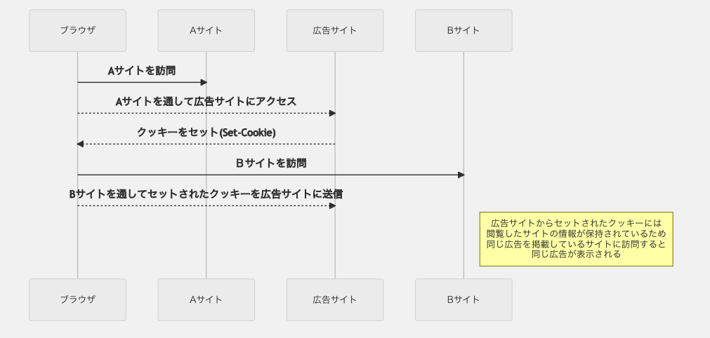

## Q1

### サードパーティクッキーとファーストパーティクッキーのそれぞれの特徴

#### サードパーティクッキー

閲覧中のドメインとクッキーの domain 属性が一致しないクッキー
広告リンクをサイトに設置している場合にその広告サイトがクッキーを発行するケースがある。  
この場合は閲覧中のドメインとは違うドメインのクッキーになるためサードパーティクッキーとなる。

#### ファーストパーティクッキー

閲覧中のドメインとクッキーの domain 属性が一致するクッキー
閲覧中のドメインが発行したクッキー

閲覧中のドメインとクッキーの domain 属性が一致するのかしないのかでサードパーティクッキーかファーストパーティクッキーなのか判断することができる

## Q2

## Q3

訪問したサイト上がクロスオリジン上の画像や JS を読み込んだ場合に`Set-Cookie`をレスポンスヘッダーとして設定されると生成されます。
その他に訪問サイト上で`iframe`を利用してクロスオリジンのサイトを表示した場合、そのサイト上でクッキーを発行するとサードパーティクッキーとなります。

## Q4

- Safari
    - サードパーティクッキーをデフォルトでブロック
- Chrome
    - 2022年1月頃にサードパーティクッキーのサポートを終了予定
- Firefox
    - サードパーティクッキーをデフォルトでブロック

この3つのブラウザの中ではSafariが最も早くサードパーティクッキーに対する対応をしていた。ついでFirefox, Chromeの順番。

## Q5

ファーストパーティクッキーになる。ドメインにはポートを含まないため、同一ドメインでポート番号が違う場合でも同じドメインから発行されたクッキーと扱うのでファーストパーティになる。

## メモ

> Apple の標準ブラウザである「Safari」では、ドメインを横断するトラッキングを防止する機能である「ITP（Intelligent Tracking Prevention）」を搭載。2017 年から徐々に規制を強めていましたが、2020 年 3 月のアップデートによりサードパーティ cookie をデフォルトで全面的にブロックしました。

> また、コンバージョントラッキングを始めとする広告の効果計測のために、cookie の代わりに用いられていた「ローカルストレージ」に関しても、即時削除されるようになりました。（※一定の条件を満たした場合には、7 日まで保持できる。）

> cookies for cross-site resources are now blocked by default across the board. This is a significant improvement for privacy since it removes any sense of exceptions or “a little bit of cross-site tracking is allowed.”

> 引用：Full Third-Party cookie Blocking and More | WebKit

- [サードパーティcookieとは？ Apple・Googleの規制による影響を解説](https://moltsinc.co.jp/data-strategy/9987/)

- [サードパーティクッキーの使い方・使い分けまとめメモ](https://kimagureneet.hatenablog.com/entry/2016/02/11/104614)

- [3rd party Cookie いただきます](https://www.techscore.com/blog/2016/06/24/3rd-party-cookie/)

- [Chrome の「サードパーティCookie」とは](https://qiita.com/bobunderson/items/1874d837de5c2a4c5d0c)

- [GDPR(General Data Protection Regulation)](https://www.ppc.go.jp/enforcement/infoprovision/laws/GDPR/)

- ITP（Intelligent Tracking Prevention）トラッキング防止機能