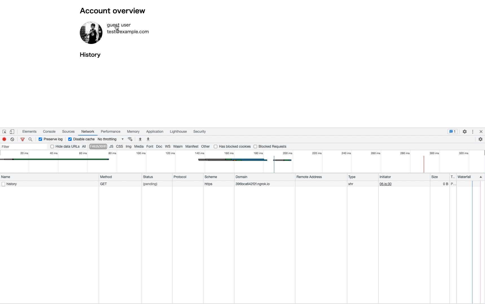

## Q1-1
CORSはクロスオリジンへのリクエストのために、安全なオプトインのメカニズムを提供する仕組み。  
クロスオリジンへXHR、Fetch API（リソース共有）を行う場合、同一生成元ポリシー（Same-Origin Policy）の制約がある。この制約を満たすためにCORSを利用する。  
クライアント側（ブラウザ）は`Origin`ヘッダーをリクエスト時に自動的に付与し、サーバー側（クロスオリジン）はレスポンスヘッダーに`Access-Control-Allow-Origin`を付与する。  
クライアント側はレスポンスヘッダーの`Access-Control-Allow-Origin`に含まれているオリジンに送信されたオリジンが含まれているかチェックし、存在している場合はクロスオリジンへのリクエストは成功（リクエスト先がエラーになっていない場合）一方、オリジンが含まれていない場合はCORSエラーとなる。  

CORSはクロスオリジンへのリクエストにおいて特定のリクエストメソッドとカスタムヘッダーの有無で`preflight request` or `simple request`に区別される。  
`simple request`の場合は「シンプルメソッド」（`GET`,`POST`,`HEAD`）とXHRが扱うことのできるHTTPヘッダのみへのアクセスに限定される。（詳しくは後述する）  
`preflight request`の場合は`PUT`,`PATCH`,`DELETE`のメソッドに該当する。（詳しくは後述する）  

補足  
>Access-Control-Allow-Origin の値で複数のオリジンに許可を限定するには、サーバー側で Origin リクエストヘッダーの値をチェックし、許可するオリジンのリストと比較して、 Origin の値がリスト中にあれば、 Access-Control-Allow-Origin の値に Origin と同じ値を設定してください。
### simple requestとは
`preflight request`に属さないリクエスト  
`preflight request`を引き起こさない条件
- メソッド
    - GET
    - HEAD
    - POST
- ヘッダー（CORSセーフリクエストヘッダー）
    - Accept
    - Accept-Language
    - Content-Language
    - Content-Type (但し、下記の要件を満たすもの)
        - application/x-www-form-urlencoded
        - multipart/form-data
        - text/plain
    - DPR
    - Downlink
    - Save-Data
    - Viewport-Width
    - Width
- XMLHttpRequestUpload(イベントリスナーが登録されていないこと)
- ReadableStream

### preflight requestとは

リクエストメソッドが`PUT`,`PATCH`,`DELETE`の場合に`preflight request`に該当する。  
`preflight request`は`OPTIONS`メソッドを用いて`Access-Control-Request-Method`,`Access-Control-Request-Headres`,`Origin`の3つのHTTPリクエストヘッダーを送信する。  
`preflight request`は`simple request`と比較して最低1往復のネットワークレイテンシが発生する。  
ただ、一度確認が取れるとその結果をクライアント側でキャッシュするため（`Access-Control-Max-Age`）、2回目からは`preflight request`は実行されない

https://developer.mozilla.org/ja/docs/Glossary/Preflight_request

## Q1-2
`Access-Control-Allow-Origin: *`をレスポンスヘッダーに設定している場合、認証情報（CookieやTLSクライアント証明書、Basic認証情報など）を送信する場合に`withCredentials=true;`を設定してもブラウザ側ではレスポンスは無視されコンテンツで使用できない。  
これを回避するためにはレスポンスヘッダーに`Access-Control-Allow-Credentials: true`を設定する必要がある。

## Q1-3
>`simple request`の場合は「シンプルメソッド」（`GET`,`POST`,`HEAD`）とXHRが扱うことのできるHTTPヘッダのみへのアクセスに限定される。
## Q1-4.
CORSエラーとなり、ブラウザ側でコンテンツとして使用できない。

## Q1-5
`withCredentials=true;`をオプションとして設定することでリクエストヘッダーにCookieが付与される。

## Q2-1. Quiz

## Q3
以下はデモサイトでXHRのリクエストをdevtoolで観察した様子である。  
`simple request`, `preflight request`それぞれの発生した様子について補足する。

- `simple request`である`GET`メソッドを実行した場合
    - `preflight request`が実行されていないことがコンソールのリストからわかる
- `preflight request`である`DELETE`メソッドを実行した場合
    - `preflight request`が実行されたことがコンソールのリストからわかる

### メモ
XMLHttpRequest
IE5で独自実装された
MSXMLライブラリの一部としてリリースされた。XMLHTTPという名前の由来

同一生成元ポリシー
ブラウザは認証トークンやクッキーなどのプライベートなユーザーデータを保持します。これらを他のアプリケーションに漏洩することは許されません。
#### オプトイン/オプトアウト
>「オプトイン」とは、ユーザーが、企業からの情報の受け取りや自らに関する情報の利用に関して、あらかじめ許可を与えること。反対に「オプトアウト」は、事前確認なく送られてくる広告やメールに対して、ユーザーが不要の場合のみ情報の受け取りや個人情報の利用を拒否することです。
https://drm.ricoh.jp/lab/glossary/g00056.html

https://medium.com/@yuhattor/cors-%E3%82%92%E9%81%8E%E4%BF%A1%E3%81%97%E3%81%99%E3%81%8E%E3%81%AA%E3%81%84-818f63b9d83d