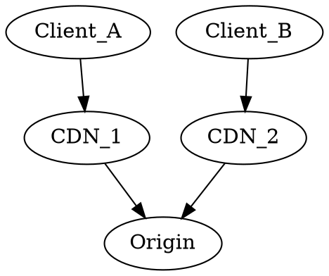
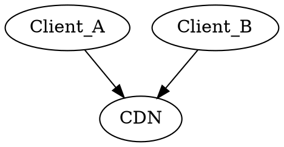

<!-- omit in toc -->
## 目次
- [キャッシュとは？](#キャッシュとは)
- [キャッシュの種類](#キャッシュの種類)
  - [ブラウザキャッシュ（ローカルキャッシュ）](#ブラウザキャッシュローカルキャッシュ)
  - [経路上のキャッシュ](#経路上のキャッシュ)
  - [プロキシキャッシュ（ゲートウェイのキャッシュ）](#プロキシキャッシュゲートウェイのキャッシュ)
- [キャッシュで利用するヘッダー](#キャッシュで利用するヘッダー)
    - [Expire](#expire)
    - [Cache-Control](#cache-control)
- [ブラウザのキャッシュの仕様について](#ブラウザのキャッシュの仕様について)
- [キャッシュのexpiresについて](#キャッシュのexpiresについて)
- [キャッシュを利用しているサービス](#キャッシュを利用しているサービス)
- [メモ](#メモ)

## キャッシュとは？
なにかしら処理をした結果を保持しておき、その結果が必要になった場合に保持していた内容をレスポンスすることで不必要な処理を省くことができ、結果的にレスポンスを早くすることができる。  
例えばDBから値を取得してレスポンスする場合、SQLが時間のかかるものであった場合に結果をキャッシュ（保持しておく）ことで二回目からはSQLの実行を減らすことができる。  
一方、古い結果を保持し続けてしまうと新しい結果を取得できない状態になってしまうので、キャッシュする期間やキャッシュする内容は慎重に設計する必要がある。

## キャッシュの種類
### ブラウザキャッシュ（ローカルキャッシュ）
CSS/JavaScript/画像などをブラウザでキャッシュしておき、サーバーから取得する必要がなく高速になる。
### 経路上のキャッシュ
Proxy/CDNを用いる、配信経路上に配置されたキャッシュ。  
キャッシュでオリジンへの負荷を減らすことやクライアントに近い場所へ配置することで経路を最適化したり、大きな配信帯域を確保したりするために導入する

### プロキシキャッシュ（ゲートウェイのキャッシュ）
オリジンでのキャッシュ。主にProxyを利用してキャッシュする。  
Varnish,nginx,[Apache Traffic Server](https://knowledge.sakura.ad.jp/10028/)など  

## キャッシュで利用するヘッダー
- Expire(強いキャッシュ)
- Cache-Control(強いキャッシュ)
- Last-Modified(弱いキャッシュ)
- ETag(弱いキャッシュ)
#### Expire
レスポンスヘッダーとして`Expire`ヘッダーに有効期限を指定することで有効期限が切れるまでは自動的にブラウザにキャッシュされたリソースを参照する。  
期限が切れるまではブラウザは一度リソースを取得するとマシン内部にキャッシュするため、一度有効になるとHTTPリクエストをサーバーに送信しなくなる。  
`Expires: Wed, 04 Aug 2021 13:50:37 GMT`

クライアントとサーバー間で時間設定が異なると、うまく設定されないケースがある。

#### Cache-Control
`CacheControl:maxage=600`  
`max-age=600`と指定しているので取得されてから600秒間はブラウザのマシン内にキャッシュされる。

**ちなみにCache-ControlとExpireが両方設定されている場合はCache-Controlヘッダーを優先する。**

shared,privateはキャッシュする対象がどのような性質を持つかという概念。

- shared(public)
  - 複数のクライアントから参照可能な性質をもつ
  - 1:nでキャッシュする。本来キャッシュできないものでもキャッシュ可能。

- private
  - 特定のクライアントのみが参照可能な性質をもつ
  - 1:1でキャッシュする。本来キャッシュできないものでもキャッシュ可能。
  - ユーザー情報を含んだAPIなど、他社から参されることを防ぐべき情報も含まれるので慎重に扱う
  
**キャッシュさせたくない場合は、`no-store`を指定すること**

- no-cache
- レスポンスが通常はキャッシュ可能でなくても、レスポンスをどのキャッシュにも格納することができます。しかし、格納されたレスポンスは使用する前に常に元のサーバーとの検証を通さなければならないので、 no-cache を immutable と組み合わせて使用することはできません。レスポンスがどのキャッシュにも保存されないようにするには、代わりに no-store を使用してください。このディレクティブにはレスポンスがキャッシュに保存されないようにする効果はありません。
## ブラウザのキャッシュの仕様について

## キャッシュのexpiresについて

## キャッシュを利用しているサービス

## メモ
[HTTPヘッダチューニング Etag・Last-Modified](https://blog.redbox.ne.jp/http-header-tuning.html)

- メモリキャッシュ
  - メモリからデータを読み込んだデータを一時的に非常に高速なメモリ（キャッシュメモリ）に貯めておき、次に利用するときに参照する
- ディスクキャッシュ
  - ディスクから読み込んだデータをメモリに貯めておき、次回からメモリから参照する
- LRU(Least Recently Used)キャッシュ
  - 直近に参照した時刻が一番古いものを捨てる。キャッシュにデータを追加したり、データを見たり、更新したりすること全般を参照という。
- ZoneApex
- CNAME Flatting機能