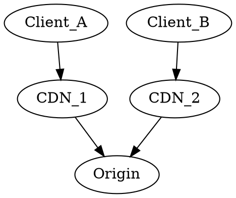
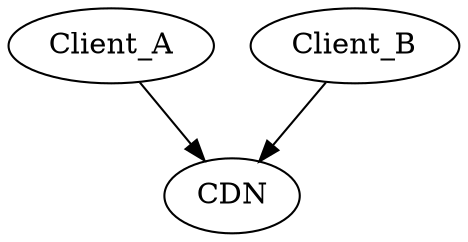
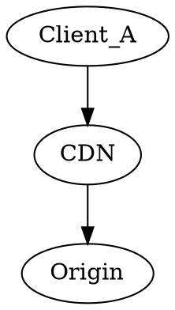
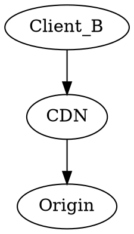
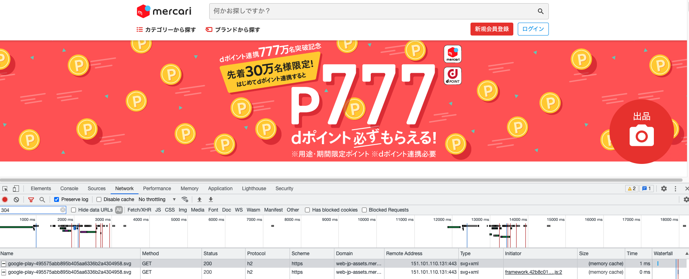
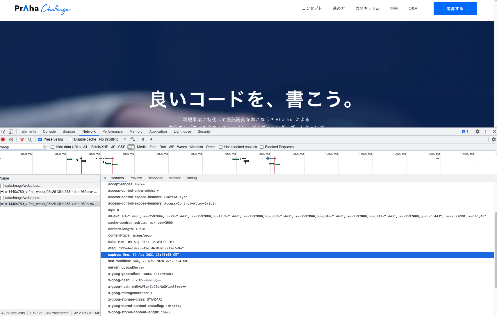
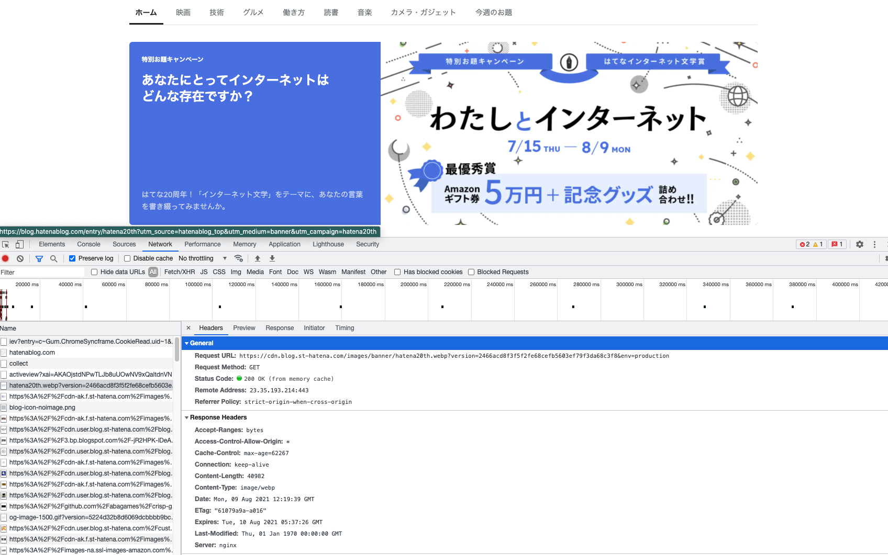

<!-- omit in toc -->
## 目次
- [キャッシュとは？](#キャッシュとは)
- [キャッシュの種類](#キャッシュの種類)
  - [クエリキャッシュ](#クエリキャッシュ)
  - [ブラウザキャッシュ（ローカルキャッシュ）](#ブラウザキャッシュローカルキャッシュ)
  - [経路上のキャッシュ](#経路上のキャッシュ)
  - [プロキシキャッシュ（ゲートウェイのキャッシュ）](#プロキシキャッシュゲートウェイのキャッシュ)
- [キャッシュで利用するヘッダー](#キャッシュで利用するヘッダー)
    - [Expires](#expires)
    - [Cache-Control](#cache-control)
  - [Last-Modified](#last-modified)
  - [ETag](#etag)
    - [キャッシュの陳腐化(stale)が発生した場合の図](#キャッシュの陳腐化staleが発生した場合の図)
    - [キャッシュさせたくない場合](#キャッシュさせたくない場合)
- [ブラウザのキャッシュサイズについて](#ブラウザのキャッシュサイズについて)
- [キャッシュのExpiresを使用しない方がよい箇所について](#キャッシュのexpiresを使用しない方がよい箇所について)
- [キャッシュを利用しているサービス](#キャッシュを利用しているサービス)
  - [メルカリ](#メルカリ)
  - [プラハチャレンジ](#プラハチャレンジ)
  - [はてなブログ](#はてなブログ)
- [メモ](#メモ)

## キャッシュとは？
なにかしら処理をした結果を保持しておき、その結果が必要になった場合に保持していた内容をレスポンスすることで不必要な処理を省くことができ、結果的にレスポンスを早くすることができる。  
例えばDBから値を取得してレスポンスする場合、SQLが時間のかかるものであった場合に結果をキャッシュ（保持しておく）ことで二回目からはSQLの実行を減らすことができる。  
一方、古い結果を保持し続けてしまうと新しい結果を取得できない状態になってしまうので、キャッシュする期間やキャッシュする内容は慎重に設計する必要がある。

## キャッシュの種類
### クエリキャッシュ
RDMS側でクエリをキャシュする。ただしMySQL8.0からは廃止され、PostgreSQLはpgpool-Ⅱを利用して実現するため、実際は使われるケースが少ない。  
>The query cache is deprecated as of MySQL 5.7.20, and is removed in MySQL 8.0.

https://dev.mysql.com/doc/refman/5.7/en/query-cache.html
### ブラウザキャッシュ（ローカルキャッシュ）
CSS/JavaScript/画像などをブラウザでキャッシュしておき、サーバーから取得する必要がなく高速になる。
### 経路上のキャッシュ
Proxy/CDNを用いる、配信経路上に配置されたキャッシュ。  
キャッシュでオリジンへの負荷を減らすことやクライアントに近い場所へ配置することで経路を最適化したり、大きな配信帯域を確保したりするために導入する


### プロキシキャッシュ（ゲートウェイのキャッシュ）
オリジンでのキャッシュ。主にProxyを利用してキャッシュする。  
Varnish,nginx,[Apache Traffic Server](https://knowledge.sakura.ad.jp/10028/)など  


## キャッシュで利用するヘッダー
- Expire(強いキャッシュ)
- Cache-Control(強いキャッシュ)
- Last-Modified(弱いキャッシュ)
- ETag(弱いキャッシュ)
#### Expires
レスポンスヘッダーとして`Expires`ヘッダーに有効期限を指定することで有効期限が切れるまでは自動的にブラウザにキャッシュされたリソースを参照する。  
期限が切れるまではブラウザは一度リソースを取得するとマシン内部にキャッシュするため、一度有効になるとHTTPリクエストをサーバーに送信しなくなる。  
`Expires: Wed, 04 Aug 2021 13:50:37 GMT`

クライアントとサーバー間で時間設定が異なると、うまく設定されないケースがある。  

また`Expires: -1`と設定することでアクセスの1秒前の時間を設定することができるため、`Cache-Control: no-cache`と組み合わせることで`Cache-Controle`が有効じゃないブラウザに関しても都度オリジンにリソースの検証を行うことができる。

#### Cache-Control
`Cache-Control`を有効にすることでブラウザにキャッシュが存在する場合にはそのリソースへのリクエストが送信されないようにすることも可能（都度キャッシュが新鮮か確認させることもできる）  

- `max-age`
  - `max-age=600`と指定した場合、取得されてから600秒間はブラウザのマシン内にキャッシュされる。

**ちなみに`Cache-Control`と`Expire`が両方設定されている場合は`Cache-Control`が優先される。**

- `shared(public)`
  - 複数のクライアントから参照可能な性質を持つ。
  - 1:nでキャッシュする。本来キャッシュできないものでもキャッシュ可能。



- `private`
  - 特定のクライアントのみが参照可能な性質を持つ。
  - 1:1でキャッシュする。本来キャッシュできないものでもキャッシュ可能。
  - ユーザー情報を含んだAPIなど、他者から参照されることを防ぐべき情報も含まれるので慎重に扱う
  


※クライアントに対してキャッシュが1:1を表す図

- `no-cache`
  - オリジンサーバーに更新がないか都度確認をし、更新がなければ`304`ステータスになり、ローカルキャッシュを参照する。更新があればそのデータを取得する。
  - オリジンサーバーに問い合わせをしているのでリクエスト自体は発生している。
- `must-revalidate`
  - `no-cache`と似た挙動を持つが、キャッシュが有効期限内であればキャッシュの検証を行わないため、リクエストが発生しない。
  - 有効期限が切れている場合はキャッシュの検証を行うためリクエストを発行する。

### Last-Modified
レスポンスヘッダーに`Last-Modified Wed, 18 Oct 2017 08:00:40 GMT`を設定することで次回ブラウザがリクエストを送信するときにはリクエストヘッダーに`If-Modified-Since Wed, 18 Oct 2017 08:00:40 GMT`を付与する。  
`If-Modified-Since`の日時と**リソースの最終変更日**を比較し、更新されてなければ`304`ステータスを返却し、不要なデータの送信を抑えることができる。この`If-Modified-Since`を含んだGETリクエストを条件付きGETリクエストと呼ぶ。  
`304 Not Modified`はレスポンスボディが含まれていない小さなHTTPレスポンス。

### ETag
`Last-Modified`と似た挙動をするが**リソースの内容が更新**されているか判断をする。リソースのinode番号と更新日時とサイズからタグを生成（`Apache`の例では`FileETag INode MTime Size`を仕様した場合）し、レスポンスヘッダーの`ETag`に設定する。  
例)`ETag: "30-448b28913d700"`  
次に同じリソースに対してリクエストを送信するときにリクエストヘッダーに`If-None-Match:"30-448b28913d700"`を設定し、サーバー側はリソースの現在のETagの値と比較し、同じであればリソースは変わってないので`304`ステータスを返す。一致しない場合は対応するキャッシュがブラウザ側にないので通常のレスポンスを返す。

#### キャッシュの陳腐化(stale)が発生した場合の図
陳腐化したリソースへのリクエストをキャッシュが受け取ると`If-None-Match`を付加してリクエストを転送する。  

https://developer.mozilla.org/ja/docs/Web/HTTP/Caching

#### キャッシュさせたくない場合
**`no-store`を指定すること**

## ブラウザのキャッシュサイズについて
- 永続的
  - 長期間に渡って保存されるため、保存する場合はユーザーに警告ポップアップが表示される。ユーザーがデータを削除する。
- 一時的
  - 長期間に渡って保存する必要がないデータ。ストレージの容量制限に達するとLRUポリシーに沿って削除される。

- Chrome
  - キャッシュサイズ
    - >Chrome allows the browser to use up to 80% of total disk space. An origin can use up to 60% of the total disk space.
    - https://web.dev/storage-for-the-web/#how-much
    - `-disk-cache-size`
      - 画像やCSSなどのキャッシュサイズ
    - `-media-cache-seize`
      - HTML5の動画や音楽のキャッシュサイズ
  - データ削除ポリシー
    - [How does eviction work?](https://web.dev/storage-for-the-web/#eviction)
      - >Chromium-based browsers will begin to evict data when the browser runs out of space, clearing all site data from the least recently used origin first, then the next, until the browser is no longer over the limit.
        - [MRU 【Most Recently Used】](https://e-words.jp/w/MRU-2.html)
- Firefox
  - キャッシュサイズ
    - デフォルト50MB
    - https://ccm.net/faq/40819-firefox-36-how-to-set-the-maximum-cache-size
  - データ削除ポリシー
    - [LRUポリシー](https://developer.mozilla.org/ja/docs/Web/API/IndexedDB_API/Browser_storage_limits_and_eviction_criteria#lru_policy)
- Safari
  - キャッシュサイズ
    - [How much can I store?](https://web.dev/storage-for-the-web/#how-much)
  - データ削除ポリシー
    - >Safari previously did not evict data, but recently implemented a new seven-day cap on all writable storage (see below).
    - >Starting in iOS and iPadOS 13.4 and Safari 13.1 on macOS, there is a seven-day cap on all script writable storage, including IndexedDB, service worker registration, and the Cache API. This means Safari will evict all content from the cache after seven days of Safari use if the user does not interact with the site. This eviction policy does not apply to installed PWAs that have been added to the home screen. See Full Third-Party Cookie Blocking and More on the WebKit blog for complete details
    - 書込み可能なすべてのストレージに7日間の上限が設定された模様

## キャッシュのExpiresを使用しない方がよい箇所について
`Expires`ヘッダーは指定した期間キャッシュしてしまい、キャッシュが陳腐化するまではローカルキャッシュを利用するため、動的に変化するページで利用した場合には古い情報を表示することになってしまう。  
動的なページはキャッシュが有効に働かないため、`Cache-Control: no-store`や`Cache-Control: no-cache`と`Expires: -1`を設定する必要がある。

## キャッシュを利用しているサービス
### メルカリ
https://web-jp-assets.mercdn.net/ から配信されている。

- `expires`がリクエストした日付より過去の日付になっている。
- `etag`が付与されている。
```
etag: "495575abb895b405aa6336b2a4304958"
expires: Fri, 09 Jul 2021 17:27:22 GMT
```


### プラハチャレンジ
https://storage.googleapis.com から配信されている。

- `etag`と`expires`が付与されている。
```
etag: "915e6ef99a8e49efd638395a9f7e7e9a"
expires: Mon, 09 Aug 2021 13:03:05 GMT
```


### はてなブログ
https://cdn.blog.st-hatena.com/ から配信されている。

- `Cache-Control`と`etag`,`expires`が付与されている。
```
Cache-Control: max-age=62267
ETag: "61079a9a-a016"
Expires: Tue, 10 Aug 2021 05:37:26 GMT
```


## メモ
[HTTPヘッダチューニング Etag・Last-Modified](https://blog.redbox.ne.jp/http-header-tuning.html)

- メモリキャッシュ
  - メモリからデータを読み込んだデータを一時的に非常に高速なメモリ（キャッシュメモリ）に貯めておき、次に利用するときに参照する
- ディスクキャッシュ
  - ディスクから読み込んだデータをメモリに貯めておき、次回からメモリから参照する
- LRU(Least Recently Used)キャッシュ
  - 直近に参照した時刻が一番古いものを捨てる。キャッシュにデータを追加したり、データを見たり、更新したりすること全般を参照という。
- ZoneApex
- CNAME Flatting機能
- [CDN切り替え作業における、Web版メルカリの個人情報流出の原因につきまして](https://engineering.mercari.com/blog/entry/2017-06-22-204500/)