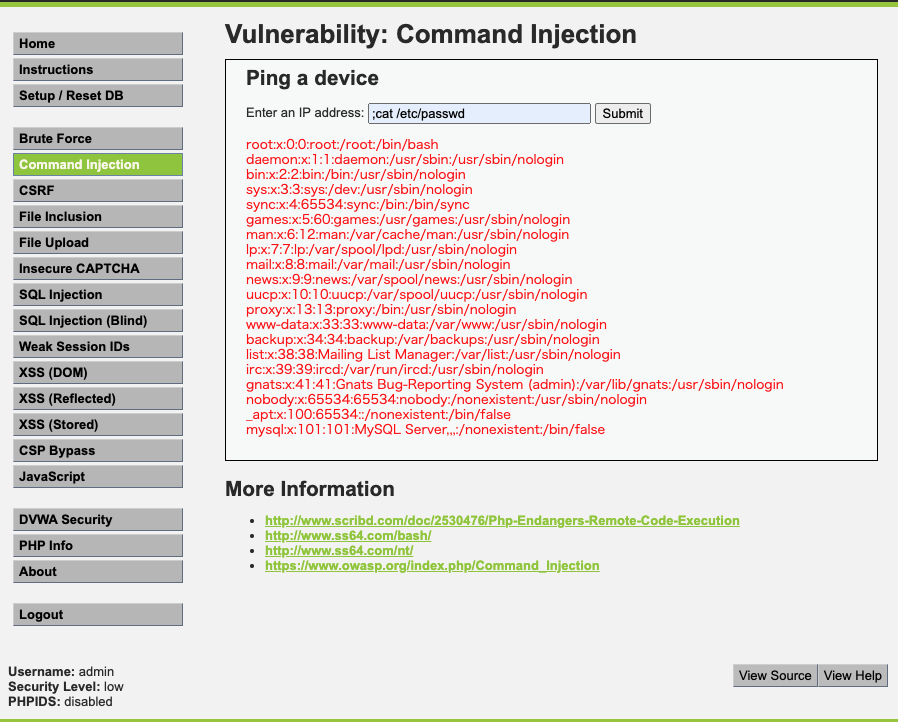

# 脆弱性について
- [脆弱性について](#脆弱性について)
  - [出力に起因する脆弱性](#出力に起因する脆弱性)
  - [Quiz](#quiz)
  - [DVWAで脆弱性を試してみる](#dvwaで脆弱性を試してみる)
    - [CSRF](#csrf)
      - [対策](#対策)
    - [OSコマンドインジェクション](#osコマンドインジェクション)
      - [対策](#対策-1)
    - [XSS(格納型)](#xss格納型)
      - [対策](#対策-2)
  - [処理に起因する脆弱性](#処理に起因する脆弱性)
  - [参考](#参考)


## 出力に起因する脆弱性
- XSS
  - 攻撃方法
    - 攻撃スクリプトを脆弱性のあるサイトに登録し（DBに保存するなど）訪問した利用者のブラウザ上で悪意あるスクリプトが実行されてしまう（格納型）
      - 入力した内容を登録できる形式のサイトがあった場合にスクリプトタグを登録するなどして攻撃をする。
    - 悪意のあるURLをクリックさせ、脆弱性のあるサイト上でスクリプトを実行させ、クッキー情報などを取得する（反射型XSS）
      - 例えば、`http://example.com/keyword=username`のようなURLがあった場合に`keyword=<script>document.cookie</script>`をURLに含んだ状態でサイトに遷移させ、サイト上でスクリプトを実行させるなど。
  - 対策
    - `<`や`"`に対するエスケープ漏れが原因なので、サニタイジングし文字列として画面に表示する。
    - 入力時にvalidateを行い、入力値として数値を期待している場合は数値以外が入力された場合にエラーとする。
    - WAFを導入しXSSに該当するリクエストを遮断する。

- SQLインジェクション
  - 攻撃方法
    - SQLの呼び出しに不備があるために発生する
    - 例えば、`SELECT id FROM users WHERE id = '$id';`というSQLがあった場合、`$id`に`1';DELETE FROM users`という文字列を渡されてしまうと結果的にこのようなSQLとなりテーブルが削除されてしまう。
      - シングルクォーテーションで囲った値をユーザーが外部から渡す（GETやPOSTの値）場合に悪意あるSQLを組み立てられてしまう。
    - `SELECT id FROM users WHERE id = '1';DELETE FROM users;`
  - 対策
    - プレースホルダを利用してSQLの組み立てを行う。
    - `SELECT id FROM users WHERE id = ?;`
      - プレースホルダには2種類あり静的、動的があり、静的プレースホルダを利用するのが良い。
        - 静的（データベース側でがんばる）
          - 値のバインドをデータベースエンジン側で行う。最初にプレースホルダーが付いたSQLがデータベースに登録される。その後、バインド値がデータベースに送られSQLが実行される。
          - SQL文がバインド前に確定するため、プレースホルダに渡すバインド値をクォートする必要がない。そのため、シングルクォートのエスケープ処理が必要ない。
          - 静的プレースホルダをPrepare Statementと呼ぶ。
        - 動的（アプリケーション側でがんばる）
          - バインドをアプリケーション側で行う。バインド時にリテラルは適切に構成されるため、処理系にバグがなければSQLインジェクションは発生しない。
          - 利用するライブラリにエスケープ処理が依存してしまう。

- コマンドインジェクション
  - 攻撃方法
    - 外部から受け取ったパラメーターをOSのコマンドの引数に渡して実行する場合に悪意のあるコマンドを渡すことで実現する。
    - 例えばアプリケーションから`system("/usr/sbin/sendmail $mail");`を実行する場合に`$mail`に`;cat /etc/passwd`が渡されるなどして意図していない処理を実行させる。
  - 対策
    - OSコマンド呼び出しを使わない実装方法を選択する
    - シェル呼び出し機能のある関数の利用を避ける
      - [OS コマンドを呼び出している実装箇所を洗い出し、現状を把握する](https://yamory.io/blog/about-os-command-injection/#:~:text=OS%20%E3%82%B3%E3%83%9E%E3%83%B3%E3%83%89%E3%82%92%E5%91%BC%E3%81%B3%E5%87%BA%E3%81%97%E3%81%A6%E3%81%84%E3%82%8B%E5%AE%9F%E8%A3%85%E7%AE%87%E6%89%80%E3%82%92%E6%B4%97%E3%81%84%E5%87%BA%E3%81%97%E3%80%81%E7%8F%BE%E7%8A%B6%E3%82%92%E6%8A%8A%E6%8F%A1%E3%81%99%E3%82%8B)
    - 外部から入力された文字列をコマンドラインのパラメーターに渡さない
    - OSコマンドに渡すパラメーターを安全な関数によりエスケープする

- CSRF(Cross-site Request Forgery)
  - 攻撃方法
    - Webアプリケーションが偽装されたリクエストを正規のものと判斷して処理を実行してしまう。
    - 罠サイトに攻撃対象のWebサービスへのリンクを設置し、そのリンクを踏ませることで「重要な処理」を実行させる。重要な処理とは「決済」や「パスワードの変更」などを指す。
      - Webサービスへのログインが前提のケースもあるが、ログインしていない状態でもログインシステムを持たない掲示板に投稿させるなどリクエストを強制することができる。
    - [CSRF攻撃の流れ](https://yamory.io/blog/about-csrf/#:~:text=%E7%B4%B9%E4%BB%8B%E3%81%97%E3%81%BE%E3%81%99%E3%80%82-,CSRF%20%E6%94%BB%E6%92%83%E3%81%AE%E6%B5%81%E3%82%8C,-%E6%94%BB%E6%93%8A%E8%80%85%E3%81%AF)
  - 対策
    - トークンを埋め込み「重要な処理」を実行する前にセッションとトークンを比較し、正規のページから遷移してきたかチェックする。
    - Same-Site属性に`Lax` or `Strict`を設定し、クッキーを送信させない。
    - `Access-Control-Allow-Origin:*`を利用せずにCORSを許可するドメインを制限しておく
    - パスワードの再入力を求める。ただし、画面遷移が増えてしまうので導入は慎重に行う。
    - リファラのチェック。同一ドメインかチェックをする。ただし、リファラは操作出来るので効果は低い。
  - XSSと似ている点
    - 罠サイト上で悪意あるスクリプトが実行されるまではXSS，CSRFは同じだが、CSRFの場合は基本的に攻撃サイトにリクエストをするに留まるが、XSSはブラウザ上でスクリプトを実行するため、攻撃手順が幅広い。


## Quiz
`Access-Control-Allow-Origin:*`を設定したサイトAがあります。このサイトで発行するファーストパーティクッキーは`Same-Site:none`となっています。  
このサイトではCSRFの対策としてトークンを利用しています。この状態でサイトAに対してCSRFは実行可能でしょうか。理由を答えてください。


## DVWAで脆弱性を試してみる

### CSRF

パスワードの変更リクエストがGETリクエストになっているため、クエリパラメーターに更新したいパスワードを含めるとパスワードの変更を行うことができる。  
例えば、以下のリンクを踏ませることでパスワードの変更を意図せず実行されてしまう。  
`http://localhost/vulnerabilities/csrf/?password_new=hoge&password_conf=hoge&Change=Change#`

パスワードが更新されたことがわかる
```
MariaDB [dvwa]> select * from users where user_id =1;
+---------+------------+-----------+-------+----------------------------------+---------------------------+---------------------+--------------+
| user_id | first_name | last_name | user  | password                         | avatar                    | last_login          | failed_login |
+---------+------------+-----------+-------+----------------------------------+---------------------------+---------------------+--------------+
|       1 | admin      | admin     | admin | c32ec965db3295bad074d2afa907b1c3 | /hackable/users/admin.jpg | 2021-09-12 02:51:06 |            0 |
+---------+------------+-----------+-------+----------------------------------+---------------------------+---------------------+--------------+
1 row in set (0.00 sec)

MariaDB [dvwa]> select * from users where user_id =1;
+---------+------------+-----------+-------+----------------------------------+---------------------------+---------------------+--------------+
| user_id | first_name | last_name | user  | password                         | avatar                    | last_login          | failed_login |
+---------+------------+-----------+-------+----------------------------------+---------------------------+---------------------+--------------+
|       1 | admin      | admin     | admin | 098f6bcd4621d373cade4e832627b4f6 | /hackable/users/admin.jpg | 2021-09-12 02:56:42 |            0 |
+---------+------------+-----------+-------+----------------------------------+---------------------------+---------------------+--------------+
1 row in set (0.00 sec)
```

#### 対策
- GETリクエストからPOSTに変える。
- トークンを利用して正規のページからリクエストされているかチェックする。
- `Access-Control-Allow-Origin`をレスポンスヘッダーに設定する。
- クッキーのSame−Site属性に`Lax`、`Secure`を有効にする。

### OSコマンドインジェクション

インプットタグに`;cat /etc/passwd`を入力した結果
`/etc/passwd`の内容が画面に表示されてしまっている。



#### 対策
コードを見ると`shell_exec`を利用しているので、引数に渡すコマンドを事前にエスケープ処理してサニタイズする。  
例) [escapeshellcmd](https://www.php.net/manual/ja/function.escapeshellcmd.php)

```
        // *nix
        $cmd = shell_exec( 'ping  -c 4 ' . $target );
```

### XSS(格納型)

Messageのインプットタグに`<script>alert('a');</script>を入力した結果.  
画面を表示した場合にcomment_id:2のcommentがそのままスクリプトとして実行されてしまう。  

```
MariaDB [dvwa]> select * from guestbook;
+------------+---------------------------------+------+
| comment_id | comment                         | name |
+------------+---------------------------------+------+
|          1 | This is a test comment.         | test |
|          2 | <script>alert('aaaa');</script> | aaa  |
+------------+---------------------------------+------+
2 rows in set (0.00 sec)
```

#### 対策
画面に表示する際に取得したcommentに対してサニタイジングする。  
例) [htmlspecialchars](https://www.php.net/manual/ja/function.htmlspecialchars)


## 処理に起因する脆弱性
- ディレクトリ・トラバーサル
  - コード内にファイルを読み込む処理がある場合に外部から読み込むファイルを指定されると意図していないファイルが読み込まされる攻撃。
  - 外部からファイル名を指定できない仕様にする。
  - ファイル名として使える文字種類を限定し、`/`ディレクトリを表すような文字はエラーとする。
- クリックジャッキング
  - 罠サイト上でサイトAをiframeで読みこみ重ね合わせて透過にしておく。罠サイトのコンテンツを操作しているように見せかけ、実際はサイトAの操作を行わせる攻撃。
  - `X-Frame-Options`をレスポンスヘッダーに追加しiframeによる読み込みを制限し対策する。

## 参考
- [安全なSQLの呼び出し方](https://www.ipa.go.jp/files/000017320.pdf)
- [OS コマンドインジェクション その危険性と対策](https://yamory.io/blog/about-os-command-injection/)
- [OWASPとは？Top 10, ZAPについてもまとめて紹介](https://yamory.io/blog/about-owasp/)


